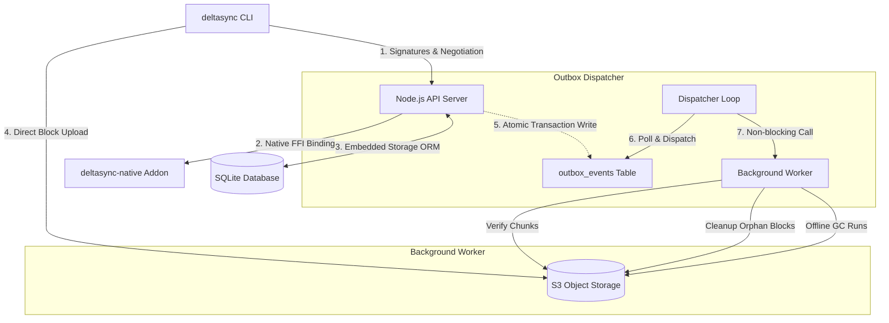

# Deltasync

[](#)
[](#)
[-orange.svg)](#)
[](#)
[](#)

Deltasync is a production-grade, high-performance delta file synchronization engine designed for massive bandwidth savings. By combining **Content-Defined Chunking (CDC)** with a **two-level rolling Adler-32 / SHA-256 deduplication** protocol, Deltasync identifies shifted content in $O(1)$ per byte and uploads only changed blocks. 

For example, modifying $1\%$ of a 4 GB file transfers only $40\text{ MB}$ over the wire instead of the entire 4 GB.

---

## 🏗 System Architecture

Deltasync's Lite Mode runs as a streamlined, single-node application utilizing high-performance, embedded systems.



---

## 🚀 Key Technical Pillars

### 1. High-Performance Native Layer (Zero-Copy Rust FFI)
*   **Rayon Multi-Core Thread Pool**: Hashing and CDC boundaries detection are offloaded to a compiled Rust extension, executing parallel computations on Rayon threads (`into_par_iter()`) to keep the Node.js event loop completely non-blocking.
*   **V8 Pointer Transmutation**: JavaScript buffers are passed directly to Rust as raw slices using raw pointer transmutations (`std::slice::from_raw_parts`) avoiding memory-copy overhead.
*   **TypeScript Fallback Engine**: Instantly falls back to pure JavaScript/TypeScript engines if the compiled binary is not available.

### 2. Event-Driven Transactional Outbox
*   **Zero-Delay Dispatching**: Utilizes an in-process `outboxNotifier` event-emitter that bypasses traditional 2-second database polling intervals.
*   **Immediate Wakeup**: Sync commits and chunk transfers trigger immediate dispatcher wakeups, initiating chunk verification tasks in less than 20ms.
*   **Concurreny & Work-Stealing**: Leverages a `worker_threads` worker pool with a work-stealing scheduler. Pending tasks are grouped by manifest complexity, ensuring small files bypass queue delays caused by ultra-large manifest files.

### 3. Stateful & Resumable CLI (`deltasync`)
*   **Stateful Journaling Cache**: Powered by a local SQLite cache database (`.deltasync/cache.db`) that logs chunk transfer states atomically.
*   **Staging Area Reconciliation**: Integrates v2 pre-signed uploads. The CLI automatically queries the server negotiations schema via `/api/public/sync/resume` to reconcile what S3 staging holds, skipping redundant uploads.
*   **Dynamic Concurrency & S3 Tuning**: Tracks network latency in real-time. Automatically scales concurrency down on `HTTP 503 Slow Down` rate-limit responses with exponential retry backoff, and scales concurrency back up when consecutive low latencies (<400ms) are observed.

### 4. Zero-Copy Binary Wire Formats
*   **DSM1 (Deltasync Manifest)**: Packed manifest formatting representing S3 block locations (`count` + array of offset, length, weak hash, and SHA-256).
*   **DSO2 (Deltasync Operations FlatBuffer)**: Zero-copy operations manifest (`shared/ops.fbs.ts`) that reads fields at computed offsets, completely bypassing JSON parser CPU overhead.

### 5. Radix-Indexed Storage Sharding & Scale GC
*   **Prefix Key Partitioning**: Key lookups in S3 are sharded prefix-wise matching the initial characters of the SHA-256 hash (e.g., `2f/2f0e4b...`), avoiding partition lock bottlenecks in massive S3 buckets.
*   **Inventory-Only GC**: Reconciles bucket contents strictly via flat S3 inventory reports, disabling real-time list API listing bottlenecks to easily scale to millions of blocks.

---

## 🛠 Tech Stack

*   **Frontend**: React 19, Tailwind CSS 4, Radix UI, Lucide React, Recharts
*   **Framework/Routing**: TanStack Start & TanStack Router (Full-Stack SSR)
*   **Backend Runtime**: Node.js (via Vite Dev Server / TanStack Server)
*   **Native Layer**: Rust (NAPI-RS + Rayon thread pool)
*   **Database**: SQLite (`better-sqlite3`), Drizzle ORM
*   **Storage**: S3-Compatible Object Storage (`@aws-sdk/client-s3` v3.600)
*   **Wire Format**: FlatBuffer-style DSO2 binary protocol (`ops.fbs.ts`)
*   **Logging**: Pino (Structured JSON logging)
*   **Testing**: Vitest (110 integration and unit test assertions)
*   **Infrastructure**: Docker, GitHub Actions

---

## ⚙️ Quick Start

### Prerequisites
*   Node.js 22+
*   S3-compatible object storage (e.g. MinIO, LocalStack, AWS S3)
*   Rust toolchain (Optional, required only for native addon compile)

### Installation & Server Setup
1.  **Clone the repository & install dependencies**:
    ```bash
    git clone https://github.com/parth2024-tech/delta-sync-engine.git
    cd delta-sync-engine
    npm install
    ```
2.  **Compile the Native Rust addon** (Optional):
    ```bash
    cd native
    cargo build --release
    # The native shared object will compile into native/deltasync-native.node
    cd ..
    ```
3.  **Configure Environment**:
    ```bash
    cp .env.example .env
    ```
    Generate a cryptographically strong secret for JWT:
    ```bash
    openssl rand -base64 32
    ```
4.  **Run Database Migrations**:
    ```bash
    npx drizzle-kit push
    ```
5.  **Launch the Server & Services**:
    The simplest way to spin up the entire Lite Mode stack (including a local MinIO bucket) is running the demo script:
    ```bash
    ./scripts/demo.sh
    ```
    Or start the development processes manually:
    ```bash
    # Terminal 1: Web Interface & API server
    npm run dev

    # Terminal 2: Event Outbox Dispatcher
    npx tsx --env-file=.env server/outbox-dispatcher.ts
    ```

### CLI Setup
1.  **Build and link the CLI**:
    ```bash
    cd cli
    npm install
    npm run build
    npm link
    ```
2.  **Usage**:
    ```bash
    # Initialize repository cache
    deltasync init --url http://localhost:5000 --key YOUR_API_KEY
    
    # Sync a file
    deltasync push my-file.bin
    ```

---

## 🧠 Synchronization Protocol

Deltasync utilizes a high-efficiency **two-phase negotiation handshake** for uploads:

```
[ deltasync CLI ]                                       [ Node.js API Server ]
        |                                                           |
        |---- 1. POST /api/public/sync/negotiate ------------------>|
        |     (Send chunk signatures: Adler32, SHA-256)             |
        |                                                           |
        |<--- 2. Returns pre-signed S3 PUT URLs for missing chunks -|
        |                                                           |
        |---- 3. Upload missing chunks directly to S3 via URLs ---->| [ S3 Bucket ]
        |                                                           |
        |---- 4. POST /api/public/sync/commit --------------------->|
        |     (Seal and finalize transaction)                       |
        |                                                           |
        |<--- 5. Returns new server version sequence ---------------|
```

1.  **Negotiation**: The client scans the local file using CDC and generates Adler-32 and SHA-256 signatures for each chunk. It sends these to the server. The server compares them against the remote manifest database.
2.  **Presigning**: The server identifies which chunks are missing in the S3 store and returns pre-signed S3 upload URLs for *only* the missing blocks.
3.  **Direct Upload**: The client streams the missing chunks directly to S3. No binary payload passes through the API server, conserving server bandwidth.
4.  **Commit**: The client issues a commit call. The server atomically updates the database, prunes old file versions, and publishes an outbox event.
5.  **Asynchronous Verification**: The event loop wakes up outbox dispatcher workers to verify the existence of the new chunks in S3 asynchronously, updating status to `verified`.

---

## 📚 Technical Documentation Map

*   **[API Specification (docs/API.md)](./docs/API.md)**: Details endpoints, query schemas, and cookie/API key validation.
*   **[Deployment Guide (docs/DEPLOYMENT.md)](./docs/DEPLOYMENT.md)**: Guides setups on Docker, AWS Fargate (ECS), and Kubernetes pods.
*   **[Environment Reference (docs/ENVIRONMENT.md)](./docs/ENVIRONMENT.md)**: Complete list of configuration variables and validation criteria.
*   **[Security HARDENING (docs/SECURITY.md)](./docs/SECURITY.md)**: Details JWT rotation, timing-attack countermeasures, database encryption, and CORS headers.
*   **[Benchmarks & Performance (docs/BENCHMARK_RESULTS.md)](./docs/BENCHMARK_RESULTS.md)**: Compares Deltasync performance metrics against S3 Sync and fixed rsync.
